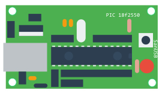
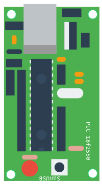
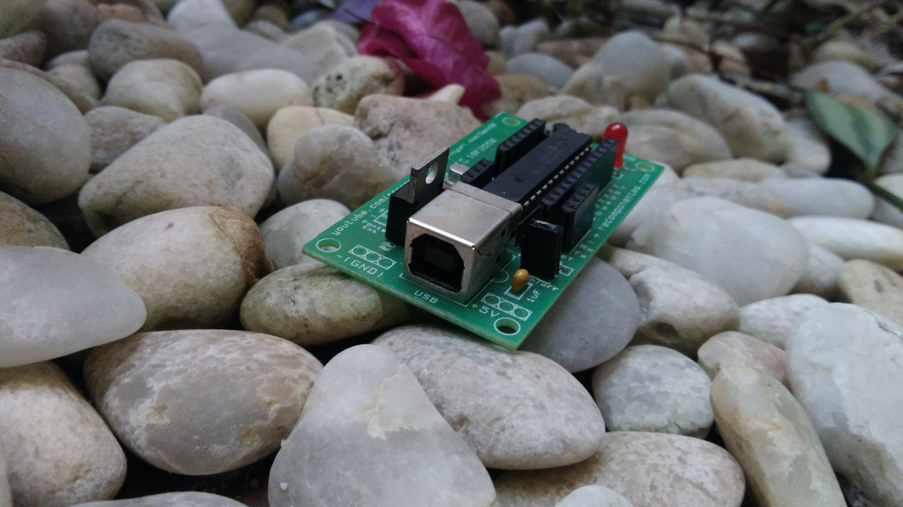
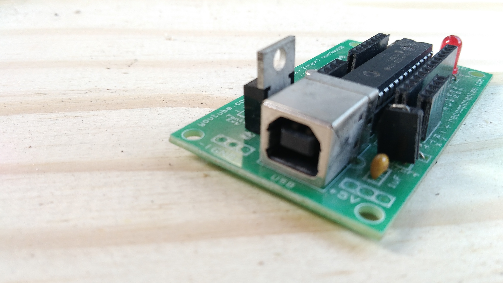

# Identidade Visual

Arquivos referentes à identidade visual tanto do SanUSB quanto grupo SanUSB

Utilize os arquivos em suas apresentações e projetos envolvendo SanUSB!

## Logo Grupo SanUSB

## Placa SanUSB PIC18F2550

Para as imagens originais vetoriais, acesse o diretório [placa/](placa/).

Agradecimentos ao [@SrMouraSilva](https://github.com/SrMouraSilva) pela arte.

### Revisão 1

### Revisão 2

## Papéis de parede

Agradecimentos ao [@SrMouraSilva](https://github.com/SrMouraSilva) pela arte.

